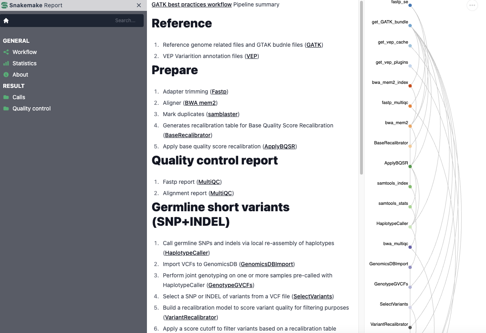
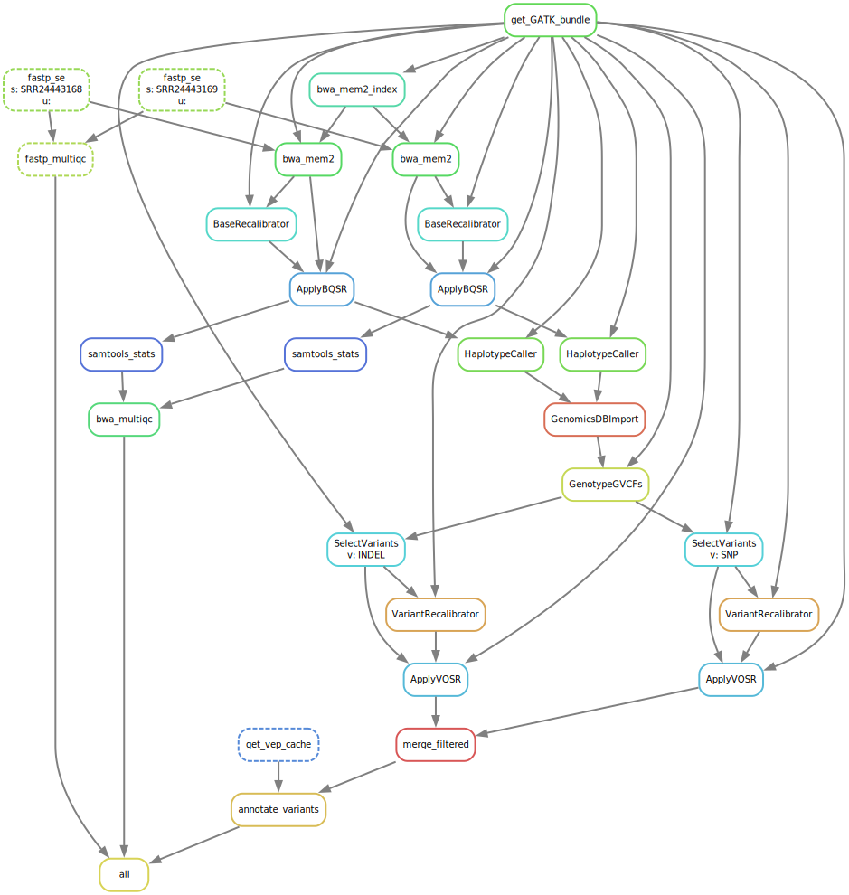

GATK best practices workflow Pipeline summary

SnakeMake workflow for Human Germline short variants (SNP+INDEL)

### Reference

1. Reference genome related files and GTAK budnle files (GATK)
2. VEP Variarition annotation files (VEP)

### Prepare

1. Adapter trimming (Fastp)
2. Aligner (BWA mem2)
3. Mark duplicates (samblaster)
4. Generates recalibration table for Base Quality Score Recalibration (BaseRecalibrator)
5. Apply base quality score recalibration (ApplyBQSR)

### Quality control report

1. Fastp report (MultiQC)
2. Alignment report (MultiQC)

### Call

1. Call germline SNPs and indels via local re-assembly of haplotypes (HaplotypeCaller)
2. Import VCFs to GenomicsDB (GenomicsDBImport)
3. Perform joint genotyping on one or more samples pre-called with HaplotypeCaller (GenotypeGVCFs)

### Filter

1. Select a SNP or INDEL of variants from a VCF file (SelectVariants)
2. Build a recalibration model to score variant quality for filtering purposes (VariantRecalibrator)
3. Apply a score cutoff to filter variants based on a recalibration table (ApplyVQSR)
4. Merge all the VCF files (Picard)

### Annotation

Annotate variant calls with VEP (VEP)

### SnakeMake Report



### Outputs

```text
├── config
│   ├── captured_regions.bed
│   ├── config.yaml
│   └── samples.tsv
├── dag.svg
├── logs
│   ├── annotate
│   ├── call
│   ├── filter
│   ├── prepare
│   ├── qc
│   ├── ref
│   └── trim
├── raw
│   ├── SRR24443168.fastq.gz
│   └── SRR24443169.fastq.gz
├── README.md
├── report
│   ├── fastp_multiqc_data
│   ├── fastp_multiqc.html
│   ├── prepare_multiqc_data
│   ├── prepare_multiqc.html
│   └── vep_report.html
├── results
│   ├── called
│   ├── filtered
│   ├── prepared
│   ├── trimmed
│   └── vep_annotated.vcf.gz
├── workflow
│   ├── envs
│   ├── report
│   ├── rules
│   ├── schemas
│   ├── scripts
│   └── Snakefile
```

### Directed Acyclic Graph

